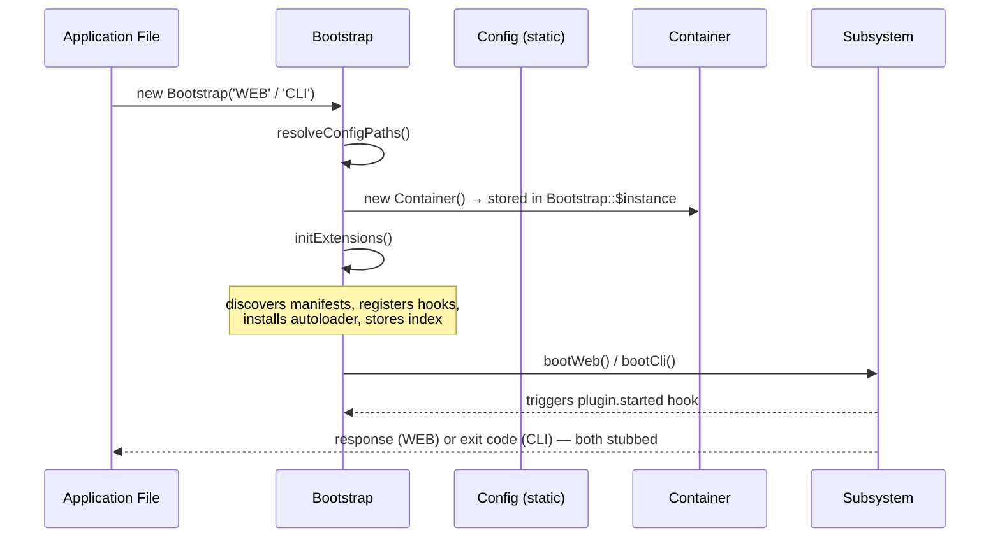

# Bootstrap Component

## Overview

The `Bootstrap` class is the single entry point for bootstrapping a Core-Web application. It orchestrates the initialization chain in a fixed order, ensuring all subsystems start in the correct sequence:

```
Config → Container → Core Services → Extensions → Mode-Specific Subsystem
```

Two modes are supported:
- **`WEB`**   — HTTP request lifecycle (router dispatch, middleware pipeline, output)
- **`CLI`**   — Command-line execution (command routing, argument parsing, exit codes)
- **`ROUTER`** — Legacy alias for `WEB` (not defined as a constant; only `'WEB'` and `'CLI'` are validated).

## Why This Design

### Single Responsibility Without Duplication

The bootstrap class encapsulates *one* concern: **ordering**. It does not contain routing logic, configuration parsing, or extension discovery. Instead, it coordinates those concerns in the correct initialization sequence, so every new application starts from an identical, well-defined state.

### Mode-Driven Initialization

By accepting a mode string at construction time, the bootstrap can serve both web and CLI contexts without conditional branching scattered across multiple classes. Each mode has its own chain that executes last, keeping the shared prefix (config → container → services) clean and reusable.

## Construction & Usage

For typical application files:

```php
<?php // index.php — HTTP entry point
require_once __DIR__ . '/vendor/autoload.php';
new Laswitchtech\CoreWeb\Bootstrap('WEB');
```

```php
#!/usr/bin/env php
<?php // cli — CLI entry point
require_once __DIR__ . '/vendor/autoload.php';
new Laswitchtech\CoreWeb\Bootstrap('CLI');
```

The bootstrap runs its full initialization chain inside the constructor, after which all registered services are available via `Bootstrap::container()`. Invalid mode values throw `\InvalidArgumentException` during construction.

## Properties

| Property      | Type              | Purpose                                            |
|---------------|-------------------|----------------------------------------------------|
| `$mode`       | `readonly string` | `'WEB'` or `'CLI'`                                 |
| `$appRoot`    | `readonly string` | Resolved application root directory (absolute path)|
| `$configPaths`| `readonly list<string>` | Resolved config file paths (`core.cfg`, optional `local.cfg`) |

A static `private static ?Container $instance` holds the DI container reference after initialization, accessible via `Bootstrap::container()`.

## Initialization Chain

### 1. App Root Resolution (`resolveAppRoot`)

Resolves `$appRoot` using a priority chain:

1. **Constant override**: If `CORE_WEB_ROOT` is defined, use that value.
2. **Script filename**: Use `dirname(realpath($_SERVER['SCRIPT_FILENAME']))` (typical WEB deployment).
3. **Current working directory**: Use `getcwd()` for CLI / simple setups.
4. **Package fallback**: Use `dirname(__DIR__)` relative to this file — for Composer-installed packages without a user app root.

The resulting `$appRoot` drives config path resolution and extension discovery.

### 2. Config Path Resolution (`resolveConfigPaths`)

Searches `{appRoot}/config/` for configuration files (only within the app root, not fallback paths):

1. Checks `{$appRoot}/config/core.cfg` — if found, `realpath()`'d and added to `$paths`.
2. Optionally checks `{$appRoot}/config/local.cfg` — if found, appended as second entry.

Both files are optional; `$paths` may be empty. Each path undergoes `realpath()` for canonical absolute paths. The resulting array is stored in `$this->configPaths`.

### 3. Config Loading (`initConfig`)

Delegates to `Config::load($this->configPaths)`. If `$configPaths` is empty (no `.cfg` files found), the call is skipped entirely and `$config` remains `null`. Deep-merge semantics within `Config::load()` apply when multiple paths are provided. See [Config Component](/docs/development/architecture/Config.md) for details.

### 4. Container Creation (`initContainer`)

Instantiates a new `Container` and stores it as the static reference `Bootstrap::$instance`:

```php
static::$instance = new Container();
```

The container is the sole DI hub for all framework services and is the only way subsystems communicate after bootstrap completes.

### 5. Core Service Registration (`registerCoreServices`)

Registers the minimal set of core framework services into the container:

| Key             | Value                  | Purpose                                        |
|-----------------|------------------------|------------------------------------------------|
| `config`        | `'Laswitchtech\CoreWeb\Config'` (string class name) | Class reference for downstream introspection (not a loaded instance — Config is static). |
| `mode`          | `'WEB'` or `'CLI'`     | Active bootstrap mode for downstream routing.  |

**Diagnostic bindings** (always registered):

| Key                | Value                 | Purpose                                        |
|--------------------|-----------------------|------------------------------------------------|
| `app_root`         | `$this->appRoot`      | Resolved application root path.                |
| `extension_base`   | string `null` or path  | First found `ext/` directory, or null.         |

When future subsystems (Database, HookRegistry, Routing) are implemented, their bindings will be added to this method.

### 6. Extensions (`initExtensions` → `registerExtensions`)

Resolves all extension manifests, validates dependencies, registers hooks and layouts into the Hook Registry, indexes metadata in the Container, and installs an autoloader. Step-by-step:

1. **Resolve base path**: Checks two candidate directories in order:
   - `{$this->appRoot}/ext` — primary (user's application root)
   - `dirname(__DIR__) . '/ext'` — fallback (package/vendor install)
   
   Stops at the first existing directory; `$extBase` is set. If neither exists, registers empty hook_registry and extension_index, then returns early (normal for Composer installs).

2. **Discover & parse manifests**: Calls `Manifest\Parser::discover($extBase)` to walk `ext/{themes,plugins}/{name}/`, producing `list<Extension>` value objects. Individual malformed manifests are logged to STDERR and skipped — the parser is tolerant by design.

3. **Early return if no manifests**: If `$manifests` is empty (all extensions misconfigured or no extensions installed), registers a fresh `Hook\Registry()` and `(object)[]` as extension_index, returns silently.

4. **Dependency sanity check** (fail fast): For each manifest with non-empty `depends`, checks that every dependency name exists in `$knownNames = array_column($manifests, 'name')`. Throws `\RuntimeException` on unresolved dependencies. Uses the known names from all successfully parsed manifests.

5. **Extension autoloader registration**: Collects `src/` directories from all extensions (`{$manifest->directory}/src`). Installs a custom `spl_autoload_register` that handles classes under `Laswitchtech\CoreWeb\Plugin\*` and `Laswitchtech\CoreWeb\Theme\*` namespaces. For each such class, strips the namespace prefix, replaces `\` with `/`, appends `.php`, and checks each extension's `src/` directory for the file. Uses `require_once` to prevent duplicate loading.

6. **Hook processing**: Creates a new `Hook\Registry()` and iterates all manifests:
   - **Hooks**: Each `$hookDef` is checked for `::`:
     - No `::`: Registered as dotted namespace with empty callback `static fn () => []`. This allows downstream subsystems to inspect which hooks are claimed (even without registered callbacks).
     - With `::`: Splits hook name from class::method (on first `::`), then extracts class FQCN and method name (from last `::`). Calls `$hookRegistry->addClassCall($hookName, "{$classFqcn}::{$methodNm}", 0)`. The autoloader (step 5) must be in place so `class_exists()` inside `addClassCall()` can load the class.
   - **Layouts**: Each layout identifier registers a callback on the pattern `layout.{$layoutDef}` with empty callback `static fn () => []`.
   - **Indexing**: Extension metadata (`type`, `version`, `directory`, `depends`) is stored in `$extIndex[$manifest->name]`.

7. **Bind into container**:
   | Key                 | Value                     | Purpose                                      |
   |---------------------|---------------------------|----------------------------------------------|
   | `hook_registry`     | `Hook\Registry` instance  | Shared hook registry                         |
   | `extension_index`   | `(object) $extIndex`      | Extension metadata keyed by name (stdClass)  |

### 7. Mode-Specific Boot (`bootWeb` or `bootCli`)

Executes the chain appropriate to the mode:

| Chain   | Key Steps                                          |
|---------|-----------------------------------------------------|
| **WEB**    | Trigger `plugin.started` hook with `['mode' => 'web']` → (TODO: Router boot, server detection, route loading, dispatch, output) |
| **CLI**    | Trigger `plugin.started` hook with `['mode' => 'cli']` → (TODO: CLIRouter boot, command loading, argv parsing, dispatch, exit) |

Both chains currently fire the `plugin.started` hook first so test plugins can run bootstrap-time logic. The actual subsystem implementations (Router, CLIRouter) are stubbed with TODO annotations in the source code.

## Bootstrap Lifecycle



## Error Handling

The bootstrap wraps `run()` in a try-catch for `\Throwable`. Errors terminate execution immediately:

- **Web / standard CLI**: `die("Bootstrap failure: " . $e->getMessage() . "\n")`
- **PHP built-in server** (`PHP_CLI_SERVER_WORKERS` defined): `fwrite(STDERR, "Bootstrap failure: {$e->getMessage()}\n")` to avoid corrupting normal stdout in worker processes.

This is intentional: a broken bootstrap indicates a hard configuration or dependency problem that cannot be recovered from.

## Static Container Access

```php
use Laswitchtech\CoreWeb\Bootstrap;

$container = Bootstrap::container(); // Returns Container | throws RuntimeException
```

Throws `RuntimeException` if called before bootstrap completes:

```php
// ❌ This will throw — no Bootstrap instance exists yet.
$container = Bootstrap::container();

// ✅ Valid — bootstrap has run.
new Laswitchtech\CoreWeb\Bootstrap('WEB');
$container = Bootstrap::container();
```

## Design Decisions

### Static Container Reference Instead of Class-Level Singleton

Using `private static ?Container $instance` provides a simple, low-overhead way for any subsystem to access the DI hub without requiring bootstrap object references. There is only ever one instance during a bootstrap lifetime because:
1. The constructor calls `$this->run()` synchronously — no separate init step required
2. A new Bootstrap instance replaces the previous `$instance` reference on construction
3. No re-initialization path exists after completion

This makes the container *effectively* singleton without using PHP's Singleton pattern, which is often considered an anti-pattern for testability reasons.

### Constructor Drives Instant Boot

The bootstrap does a runtime boot inside the constructor rather than requiring explicit init methods (`new Bootstrap('CLI'); $bootstrap->run();`). This ensures:
- No accidental partial initialization
- The entry point file remains two lines (no optional method calls to forget)
- Exceptions are always caught at construction time, not later

### Config Path Deduplication

The bootstrap uses `realpath()` on config paths to ensure canonical absolute paths, preventing the same physical file from being loaded twice when CWD and vendor resolve to overlapping directories. No explicit dedup check is needed because realpath normalizes symlinks and path components.

### App Root Resolution Priority Chain

Multiple heuristics for `$appRoot` allow flexible deployment: `CORE_WEB_ROOT` constant gives external overrides, `SCRIPT_FILENAME` handles standard web hosting, `getcwd()` covers CLI usage, and the package-relative fallback works for Composer-installed packages without a user project root. In practice most deployments hit only the first or second rule.

### Early Returns When No Extensions

If no `ext/` directory exists or no valid manifests are found, bootstrap completes normally — it's not considered an error to ship with zero extensions. This allows Composer-installed packages to function as framework-only installations without requiring users to create dummy extension directories.
