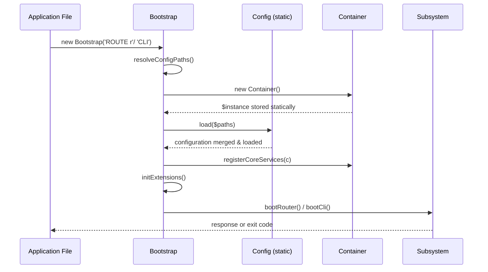

# Bootstrap Component

## Overview

The `Bootstrap` class is the single entry point for bootstrapping a Core-Web application. It orchestrates the initialization chain in a fixed order, ensuring all subsystems start in the correct sequence:

```
Config → Container → Core Services → Extensions → Mode-Specific Subsystem
```

Two modes are supported:
- **`ROUTER`** — Standard HTTP request lifecycle (router dispatch, middleware pipeline, output)
- **`CLI`**   — Command-line execution (command routing, argument parsing, exit codes)

## Why This Design

### Single Responsibility Without Duplication

The bootstrap class encapsulates *one* concern: **ordering**. It does not contain routing logic, configuration parsing, or extension discovery. Instead, it coordinates those concerns in the correct initialization sequence, so every new application starts from an identical, well-defined state.

### Mode-Driven Initialization

By accepting a mode string at construction time, the bootstrap can serve both web and CLI contexts without conditional branching scattered across multiple classes. Each mode has its own chain that executes last, keeping the shared prefix (config → container → services) clean and reusable.

## Construction & Usage

For typical application files:

```php
<?php // index.php — HTTP entry point
require_once __DIR__ . '/vendor/autoload.php';
new Laswitchtech\CoreWeb\Bootstrap('ROUTER');
```

```php
#!/usr/bin/env php
<?php // cli — CLI entry point
require_once __DIR__ . '/vendor/autoload.php';
new Laswitchtech\CoreWeb\Bootstrap('CLI');
```

The bootstrap runs its full initialization chain inside the constructor, after which all registered services are available via `Bootstrap::container()`.

## Initialization Chain

### 1. Config Resolution (`initConfig`)

Loads configuration files in order:

| Step | File          | Purpose                                   |
|------|---------------|-------------------------------------------|
| 1    | `core.cfg`    | Framework-level defaults (always required) |
| 2    | `local.cfg`   | User/application overrides (optional)      |

Config files are searched in this order:
1. CWD-relative — `./config/core.cfg`
2. Framework vendor path — `<vendor>/laswitchtech/core-web/config/core.cfg`

The search stops on the first match for each file type, preventing duplicate merges from multiple package copies. See [Config Component](/docs/development/architecture/Config.md) for deep-merge semantics.

### 2. Container Creation (`initContainer`)

Instantiates a new `Container` and stores it as a static reference (`Bootstrap::$instance`). The container is the sole DI hub for all framework services and is the only way subsystems communicate after bootstrap completes.

### 3. Core Service Registration (`registerCoreServices`)

Registers the minimal set of core framework services into the container:

| Key      | Value            | Purpose                                        |
|----------|------------------|-------------------------------------------------|
| `config` | `Config::class`  | Reference to the active config instance          |
| `mode`   | `'ROUTER'` / `'CLI'` | Active bootstrap mode for downstream routing  |

When future subsystems (Database, HookRegistry, Routing) are implemented, their bindings will be added to this method.

### 4. Extension Loading (`initExtensions`)

Scans the `extensions/` directory tree for theme/plugin manifests and registers hook callbacks. Currently a placeholder — implementation begins when Extension Manager is developed.

**Planned behavior:**
1. Walk `extensions/{theme,plugin}/{name}/` directories
2. Validate manifest schema (`type`, `name`, `version`, `hooks`, `layouts`, `depends`)
3. Register declared hook callbacks during the pre-boot phase (before subsystem dispatch)

### 5. Mode-Specific Boot (`bootRouter` or `bootCli`)

Executes the chain appropriate to the mode:

| Chain   | Key Steps                                          |
|---------|-----------------------------------------------------|
| **ROUTER** | Create Router → detect server type → load core routes → dispatch request → output response |
| **CLI**    | Create CLIRouter → register commands → parse `$_SERVER['argv']` → resolve handler → execute → exit code |

Both chains are currently stubbed; their TODO annotations detail the implementation contract.

## Bootstrap Lifecycle



## Error Handling

Bootstrap errors terminate execution immediately via `die()` (web) or `fwrite` + error output (CLI). This is intentional: a broken bootstrap indicates a hard configuration or dependency problem that cannot be recovered from.

When the PHP built-in development server defines `PHP_CLI_SERVER_WORKERS`, verbose stderr output avoids corrupting normal stdout in worker processes.

## Static Container Access

```php
use Laswitchtech\CoreWeb\Bootstrap;

$container = Bootstrap::container(); // Returns Container | throws RuntimeException
```

Throws `RuntimeException` if called before bootstrap completes:

```php
// ❌ This will throw — no Bootstrap instance exists yet.
$container = Bootstrap::container();

// ✅ Valid — bootstrap has run.
new Bootstrap('ROUTER');
$container = Bootstrap::container();
```

## Design Decisions

### Static Container Reference Instead of Class-Level Singleton

Using `private static ?Container $instance` (avoiding the `readonly` modifier on static properties) provides a simple, low-overhead way for any subsystem to access the DI hub without requiring bootstrap object references. There is only ever one instance during a bootstrap lifetime because:
1. The constructor calls `$this->run()` synchronously
2. A new Bootstrap instance replaces the previous `$instance` reference on construction
3. No re-initialization path exists after completion

This makes the container *effectively* singleton without using PHP's `Singleton` pattern, which is often considered an anti-pattern for testability reasons.

### Constructor Drives Instant Boot

The bootstrap does a runtime boot inside the constructor rather than requiring explicit init methods (`new Bootstrap('CLI'); $bootstrap->run();`). This ensures:
- No accidental partial initialization
- The entry point file remains two lines (no optional method calls to forget)
- Exceptions are always caught at construction time, not later

### Config Path Deduplication

The dedup check (`in_array($real, $paths, true)`) prevents the same physical configuration file from being loaded twice when CWD and vendor resolve to overlapping directories.
